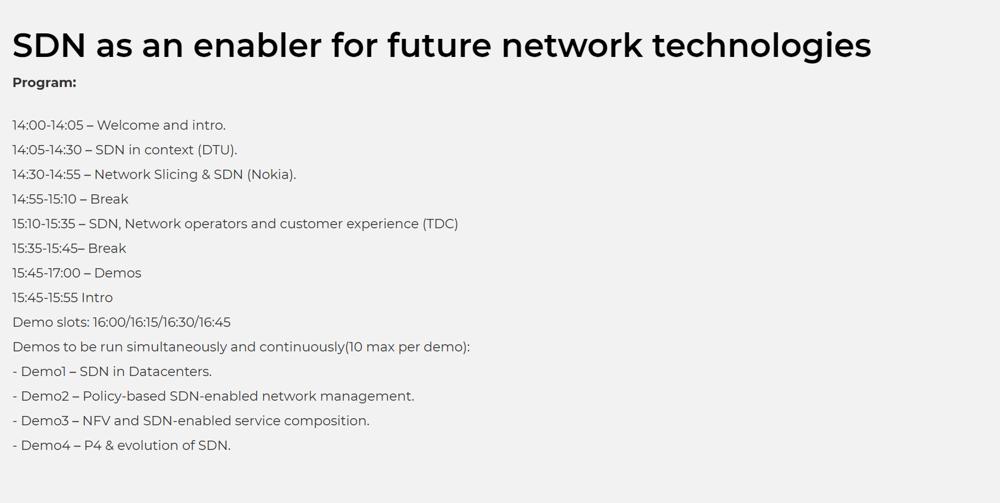

# 2018 IDA Connect SDN event

# Acknowledgements

When building this demo I rmember checking the work of several people and I tried to keep noted as many as I could.

1) I checked Jonghwan Hyun's work way beofre this wiki because the event was on 2018. I wish I had seen this post before. But I did understand many of the parts thanks to him.
  - Link: https://wiki.onosproject.org/display/ONOS/In-band+Network+Telemetry+%28INT%29+with+ONOS+and+P4
2) I also remember checking parts from old ONOS source code with INT. I cannot remember all the authors but I am pretty sure Carmelo Cascone was involver. Probably other too, I will try to check otu if I noted any other person.
  - https://github.com/opennetworkinglab/onos

I checked many more projects but I cannot remeber them all.

# Missing parts

I did use Grafana and a MariaDB database. I would change the MariaDB database to InfluxDB and the UDP packet parser in scapy has to be changed to a pure UDP server as fast as possible. It will perform very poorly.
I will try to add a VM with the working code in the future days. Possibly adding a UDP server that can at least continue using the MariaDB until the database is migrated.

# Other repositories

I just found this repository from GEANT. It seems to be more complete than mine at this point in time.
- https://github.com/GEANT-DataPlaneProgramming/int-platforms
